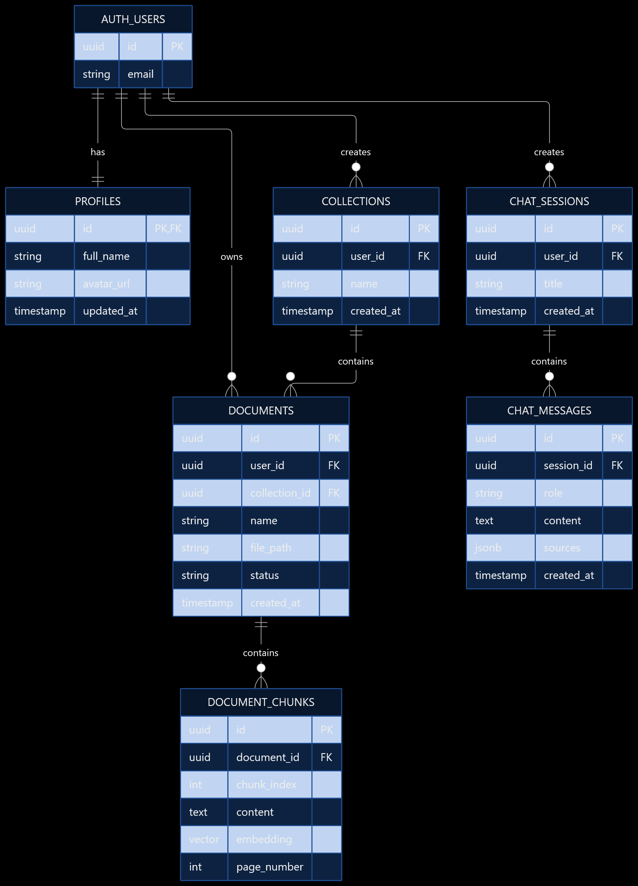
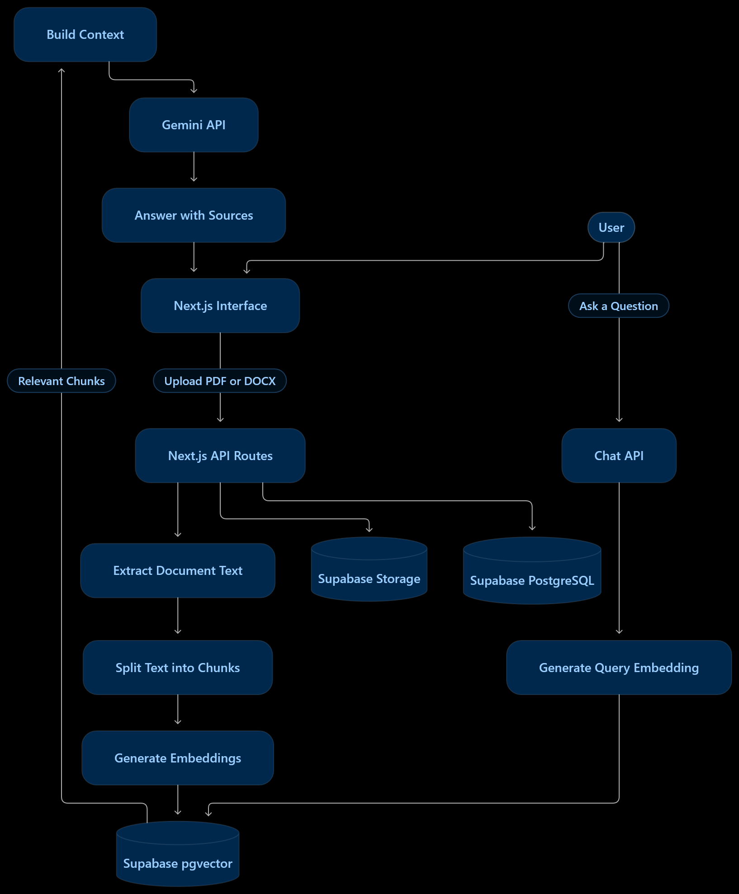
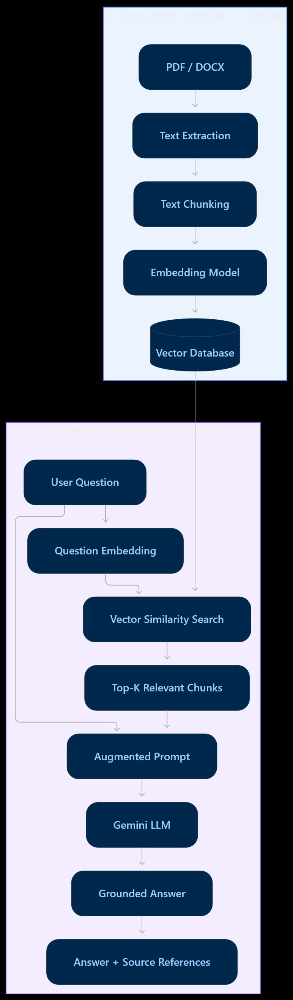

# KagojMind

### Turn documents into knowledge.

An AI-powered document intelligence workspace for uploading documents,
discovering information, and getting context-aware answers with source
references.
:::

------------------------------------------------------------------------

## Overview

KagojMind is a document intelligence SaaS application designed to make
information inside documents easier to find and understand. Users can
organize documents, generate AI-assisted summaries, search document
content semantically, and ask questions with answers grounded in
retrieved document passages.

The project combines Next.js with Supabase for authentication,
PostgreSQL, vector search, and file storage, plus Google Gemini for
AI-powered processing and responses.

> **Project status:** Portfolio / MVP project. Available functionality
> depends on the current implementation and configured external
> services. Verify the repository and database migrations for the exact
> production schema and enabled features.

## Features

-   **Authentication:** Supabase Auth and configured sign-in methods.
-   **Document management:** Upload and organize supported PDF and DOCX
    documents.
-   **Document processing:** Extract text, split content into chunks,
    and prepare it for retrieval.
-   **AI summaries:** Generate summaries and key takeaways from document
    content.
-   **Semantic search:** Find relevant document passages using
    embeddings and vector similarity.
-   **RAG-powered assistant:** Ask questions about documents and receive
    context-grounded answers with source references where available.
-   **Collections:** Group documents for easier organization.
-   **Dashboard:** Access documents and workspace features from a
    central interface.
-   **Privacy controls:** Supabase Row Level Security (RLS) and private
    storage policies, when correctly configured.
-   **English and Bangla UI:** Switch languages using the project's
    translation system.
-   **Theme support:** Light, dark, and system themes.

## Tech Stack

  Area                  Technology
  --------------------- ----------------------
  Framework             Next.js App Router
  Language              TypeScript
  Styling               Tailwind CSS
  UI components         shadcn/ui
  Icons and animation   Lucide React, Motion
  Authentication        Supabase Auth
  Database              Supabase PostgreSQL
  Vector search         pgvector
  File storage          Supabase Storage
  Generative AI         Google Gemini API
  Deployment            Vercel (recommended)

## How RAG Works

KagojMind uses Retrieval-Augmented Generation (RAG) to ground AI
responses in document content.

1.  **Upload:** A user uploads a supported document.
2.  **Extract:** The application extracts readable text.
3.  **Chunk:** Extracted text is divided into smaller passages.
4.  **Embed:** An embedding model converts passages into vectors.
5.  **Store:** Chunks, metadata, and embeddings are stored for
    retrieval.
6.  **Retrieve:** A question is embedded and matched against relevant
    chunks using vector similarity.
7.  **Generate:** Relevant passages are supplied as context to the
    Gemini model.
8.  **Respond:** The assistant returns an answer and source references
    when available.

RAG helps ground responses in source material, but it does not guarantee
that every answer is correct. Verify important information against the
cited passages.

## Architecture

-   **Next.js frontend:** Landing page, authentication, dashboard,
    document interface, search, collections, settings, and assistant.
-   **Next.js API routes:** Server-side document processing and AI
    operations.
-   **Supabase Auth:** User identity and sessions.
-   **Supabase PostgreSQL:** Application records and document metadata.
-   **Supabase Storage:** Uploaded document files.
-   **pgvector:** Embedding storage and similarity search.
-   **Gemini API:** AI operations according to the models configured in
    the application.

### Architecture diagrams


#### 1. Entity Relationship Diagram (ERD)

Shows the logical relationships between users, profiles, documents, collections, document chunks, chat sessions, and messages.



#### 2. Data Flow Diagram

Shows the main data paths through KagojMind, from document upload and processing to question answering and response delivery.



#### 3. RAG Model Diagram

Illustrates document ingestion, chunk embeddings, vector retrieval, context construction, and AI answer generation.




## Getting Started

### Prerequisites

-   Node.js version supported by the installed Next.js release
-   npm
-   A Supabase project
-   A Google AI Studio API key for Gemini
-   Git

### 1. Clone the repository

Replace the placeholder with your repository URL:

``` bash
git clone <YOUR_REPOSITORY_URL>
cd kagojmind
```

### 2. Install dependencies

``` bash
npm install
```

### 3. Configure environment variables

Create `.env.local` in the project root using the variables below. Never
commit this file.

### 4. Configure Supabase

1.  Configure the Supabase URL and publishable key.
2.  Apply the SQL migrations or schema setup scripts included in the
    repository.
3.  Enable required PostgreSQL extensions, including pgvector if used by
    the schema.
4.  Configure Row Level Security policies for user-owned records.
5.  Create the required private Storage bucket and policies.
6.  Configure authentication providers and allowed redirect URLs.

Use the repository migrations as the source of truth. Do not recreate
tables from an illustrative diagram without checking the existing
schema.

### 5. Start the development server

``` bash
npm run dev
```

Open <http://localhost:3000>.

### 6. Build for production

``` bash
npm run build
npm run start
```

Run any additional lint or type-check scripts defined in `package.json`.

## Environment Variables

The main variables for the current project setup are:

``` dotenv
NEXT_PUBLIC_SUPABASE_URL=https://YOUR_PROJECT_REF.supabase.co
NEXT_PUBLIC_SUPABASE_PUBLISHABLE_KEY=your_supabase_publishable_key
GEMINI_API_KEY=your_gemini_api_key
```

-   `NEXT_PUBLIC_SUPABASE_URL`: Supabase project URL.
-   `NEXT_PUBLIC_SUPABASE_PUBLISHABLE_KEY`: Supabase publishable key
    used by Supabase helpers.
-   `GEMINI_API_KEY`: Google Gemini API key for server-side AI
    functionality.

Search the codebase for `process.env` and include any additional
variables required by implemented routes or deployment configuration.

**Security notes** - Never expose `GEMINI_API_KEY` in client components
or through a `NEXT_PUBLIC_` variable. - Never commit credentials, access
tokens, or service-role keys. - Keep `.env.example` limited to variable
names and safe placeholder values. - Use separate development and
production credentials where practical.

## Deployment

Vercel is a suitable deployment target for this Next.js application.

1.  Push the repository to GitHub.
2.  Import it into Vercel.
3.  Add all required environment variables in Vercel project settings.
4.  Deploy and review build logs.
5.  Add the production domain to Supabase Auth's Site URL and allowed
    redirect URLs.
6.  Configure OAuth provider settings and callback URLs if OAuth is
    enabled.
7.  Test authentication, uploads, processing, summaries, search, RAG
    answers, and access controls on the deployed site.

Test workflows using non-sensitive sample documents. A successful
deployment does not guarantee that all external integrations are
configured correctly.

Use the actual repository tree when documenting specific routes,
migrations, or service modules.

## Privacy and Security

-   Store documents privately unless public access is an intentional
    requirement.
-   Apply RLS so users can only access records they are authorized to
    view.
-   Validate file types and sizes on the server.
-   Keep AI provider credentials server-side.
-   Avoid logging document contents, tokens, or personal information
    unnecessarily.
-   Review provider data handling and privacy requirements before
    processing sensitive documents.
-   Test authorization with multiple accounts before production use.

Security depends on actual database policies, storage policies, and
server-side authorization checks; UI restrictions alone are not
sufficient.

## Known Limitations

-   AI answers can be incomplete or incorrect; verify important details
    against source documents.
-   Retrieval quality depends on extraction, chunking, embeddings,
    similarity thresholds, and model configuration.
-   Scanned PDFs may require OCR if the extraction pipeline does not
    recognize their text.
-   API availability, quotas, and rate limits depend on the Gemini
    account and configured model.
-   Large files may require additional processing and timeout handling.
-   Diagrams are documentation aids and should be checked against the
    implemented schema and pipeline.

## Roadmap Ideas

Potential future improvements:

-   OCR for scanned PDFs
-   Better source previews and page-level citations
-   Background processing for large documents
-   Processing progress and retry handling
-   Document sharing and access controls
-   Retrieval and answer-grounding evaluation tests
-   AI usage limits and observability
-   Automated tests for authentication, authorization, and document
    processing

## Contributing

Contributions and suggestions are welcome.

1.  Fork the repository.
2.  Create a feature branch.
3.  Keep changes focused and consistent with the existing architecture.
4.  Run the production build and relevant checks.
5.  Open a pull request describing the change and how it was tested.

## License

No license is specified in this README. Add a `LICENSE` file and update
this section before distributing or accepting reuse of the project.

------------------------------------------------------------------------


**KagojMind --- Turn documents into knowledge.**

Built as a full-stack AI document intelligence project.

